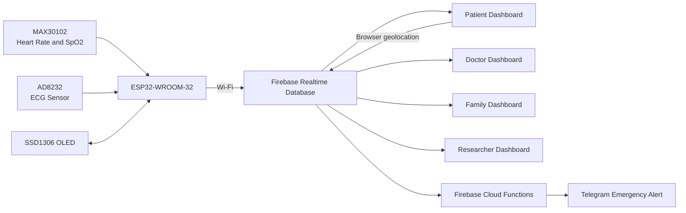

# Heartlyf

Heartlyf is an IoT-based cardiac monitoring prototype that connects an ESP32 wearable to a real-time web dashboard. It collects heart rate, SpO2, and ECG readings, stores them in Firebase Realtime Database, detects abnormal values, and can notify caregivers through Telegram with the patient's latest location.

The project was built to demonstrate the complete journey of a health reading: from a sensor attached to a patient, through an ESP32 and the cloud, to role-specific dashboards used by patients, doctors, family members, and researchers.

> **Important:** Heartlyf is an academic prototype, not a certified medical device. Its readings and alerts must not be used as a substitute for professional diagnosis or emergency care.

## What the Project Demonstrates

- Live heart rate, SpO2, and ECG monitoring from an ESP32
- Firebase Realtime Database synchronization
- Email/password and Google authentication
- Role-based access for patients, doctors, family members, and researchers
- Live charts, ECG visualization, device status, and historical readings
- Threshold-based tachycardia, bradycardia, and low-SpO2 alerts
- Browser GPS capture and Google Maps links in emergency alerts
- Telegram alert delivery through Firebase Cloud Functions
- ML risk records and a local cardiac-analysis fallback
- JSON and CSV data exports for research

## System Flow



The ESP32 writes a new vital record every two seconds and sends ECG samples more frequently. All dashboards listen to the same Firebase database, so a change made by the device appears on-screen without refreshing the page. When a value crosses a configured threshold, a Firebase Function creates an alert, attaches the latest available location, and queues a Telegram message.

## Dashboards

### Patient

The patient dashboard is the main monitoring view. It shows live vitals, ECG data, alerts, historical readings, ML predictions, device status, profile details, and threshold settings. It can also share the browser's current location for emergency alerts.

### Doctor

The doctor dashboard provides a clinical overview of the connected patient. Doctors can inspect live and historical ECG data, review abnormal events, resolve alerts, read device logs, run an analysis, and adjust alert settings.

### Family

The family dashboard is designed for quick remote monitoring. It shows the patient's current status, recent vitals, alert history, and emergency location information without exposing the full research interface.

### Researcher

The researcher dashboard exposes aggregated metrics, raw ECG samples, ML prediction records, and a Firebase database explorer. Data can be exported as JSON or CSV for further analysis.

## Technology Stack

| Layer | Technology |
| --- | --- |
| Frontend | HTML, CSS, vanilla JavaScript, Chart.js |
| Authentication | Firebase Authentication |
| Database | Firebase Realtime Database |
| Hosting | Firebase Hosting |
| Backend automation | Firebase Cloud Functions, Node.js 20 |
| Notifications | Telegram Bot API |
| Hardware | ESP32-WROOM-32, MAX30102, AD8232, SSD1306 OLED |
| Firmware | Arduino framework, Firebase ESP32 Client, SparkFun MAX30105, U8g2, ArduinoJson |

## Project Structure

```text
Heartlyf/
|-- index.html                    # Public project landing page
|-- auth.html                     # Sign-in and registration
|-- verify-email.html             # Email verification page
|-- patient-dashboard.html        # Patient monitoring interface
|-- doctor-dashboard.html         # Doctor monitoring interface
|-- family-dashboard.html         # Family monitoring interface
|-- researcher-dashboard.html     # Research and export interface
|-- css/
|   `-- common.css                # Shared dashboard styles
|-- js/
|   |-- firebase-config.js        # Firebase web configuration
|   |-- firebase-auth.js          # Authentication and role guards
|   |-- firebase-db.js            # Database reads, listeners, and writes
|   |-- charts.js                 # Dashboard charts
|   |-- ecg.js                    # ECG canvas visualization
|   |-- ecg-simulator.js          # ECG demonstration helper
|   `-- ai.js                     # AI request and local analysis fallback
|-- esp32/
|   `-- heartlyft_esp32.ino       # ESP32 firmware
|-- functions/
|   |-- index.js                  # Alert detection and Telegram delivery
|   `-- package.json
|-- firebase-database-import.json # Ready-to-import demonstration dataset
|-- firebase-structure.json       # Reference database schema
|-- firebase.json                 # Firebase Hosting and Functions config
`-- TELEGRAM_ALERT_SETUP.md       # Focused Telegram setup notes
```

## Quick Start: Dashboard Demonstration

This is the fastest way to demonstrate the web application without assembling the hardware first.

### Prerequisites

- A modern browser
- Python 3, Node.js, or another local static-file server
- A Firebase project with Authentication and Realtime Database enabled
- Firebase CLI for deployment and Cloud Functions

### 1. Clone and open the project

```bash
git clone <your-repository-url>
cd Heartlyf
```

### 2. Configure Firebase

Create a Firebase web application and replace the values in `js/firebase-config.js` with your Firebase configuration.

In the Firebase console:

1. Enable **Authentication**.
2. Enable **Email/Password** and optionally **Google** sign-in.
3. Create a **Realtime Database**.
4. Import `firebase-database-import.json` into the root of the database to load demonstration readings.
5. Configure database security rules appropriate for your environment.

The included import file provides sample data for device `esp32_001`, including normal vitals, ECG samples, users, settings, and alerts.

### 3. Run the frontend locally

Because Heartlyf is a static web application, it does not require a frontend build step.

```bash
python -m http.server 8080
```

Open `http://localhost:8080`.

Do not open the HTML pages directly with a `file://` URL. Authentication, browser location, and some network features require the site to be served over HTTP or HTTPS.

### 4. Create demo users

Register one account for each role from `auth.html`:

- Patient
- Doctor
- Family
- Researcher

Verify each email before signing in. Heartlyf stores the selected role in `/users/{uid}/role` and redirects the user to the matching dashboard.

### 5. Demonstrate the application

A useful presentation flow is:

1. Open the landing page and explain the sensor-to-dashboard architecture.
2. Sign in as a patient and show the live vitals, ECG view, history, ML prediction, and settings.
3. Allow browser location access so Heartlyf can write the latest GPS position to Firebase.
4. Change `/vitals/esp32_001/latest/bpm` in Firebase to `135`.
5. Show the abnormal reading and generated alert on the patient dashboard.
6. Sign in as a doctor to review and resolve the alert.
7. Open the family dashboard to show remote caregiver monitoring.
8. Open the researcher dashboard and export ECG or vitals data as CSV.
9. If Telegram is configured, show the emergency message and Google Maps link received by the configured chat.

## Firebase Cloud Functions and Telegram Alerts

The Cloud Functions in `functions/index.js` monitor database writes and provide the recommended notification path. They:

- Detect high BPM, low BPM, and low SpO2
- Detect a high ML risk record
- Avoid repeated alerts of the same type for 60 seconds
- Read the latest GPS location
- Create alert and log records
- Send Telegram messages to configured chat IDs

Install and deploy the functions:

```bash
cd functions
npm install
cd ..
firebase login
firebase use <your-firebase-project-id>
firebase functions:config:set telegram.token="YOUR_TELEGRAM_BOT_TOKEN"
firebase deploy --only functions
```

Set the destination chat ID at:

```text
/settings/esp32_001/notifications/telegramChatId
```

You can manually trigger the alert flow by writing the following value to `/vitals/esp32_001/latest`:

```json
{
  "bpm": 135,
  "spo2": 98,
  "ecg": 512,
  "rhythm": "Tachycardia",
  "timestamp": 1710000000000
}
```

For newer Firebase deployments, prefer a Functions secret or the `TELEGRAM_BOT_TOKEN` environment variable instead of legacy runtime config.

## ESP32 Hardware Setup

### Components

- ESP32-WROOM-32 development board
- MAX30102 heart rate and SpO2 sensor
- AD8232 ECG sensor
- SSD1306 0.96-inch OLED display
- ECG electrodes and jumper wires

### Wiring

| Component | Signal | ESP32 Pin |
| --- | --- | --- |
| MAX30102 | SDA | GPIO 21 |
| MAX30102 | SCL | GPIO 22 |
| SSD1306 OLED | SDA | GPIO 21 |
| SSD1306 OLED | SCL | GPIO 22 |
| AD8232 | OUTPUT | GPIO 34 |
| AD8232 | LO+ | GPIO 32 |
| AD8232 | LO- | GPIO 33 |

Connect all modules to the correct supply voltage and a shared ground. Verify the voltage requirements of your exact sensor boards before powering them.

### Arduino Libraries

Install these libraries from the Arduino Library Manager:

- Firebase ESP32 Client by Mobizt, version 4.4.x
- SparkFun MAX3010x Sensor Library
- U8g2
- ArduinoJson

### Flash the firmware

1. Open `esp32/heartlyft_esp32.ino` in Arduino IDE.
2. Select the correct ESP32 board and serial port.
3. Update `WIFI_SSID`, `WIFI_PASSWORD`, and Firebase credentials.
4. Confirm that `DEVICE_ID` matches the dashboard device ID, which is `esp32_001` by default.
5. Upload the sketch.
6. Open Serial Monitor to confirm Wi-Fi, Firebase, sensor, and OLED initialization.

The firmware uploads:

```text
/devices/esp32_001
/vitals/esp32_001/latest
/vitals/esp32_001/history/{timestamp}
/ecg_data/esp32_001/{timestamp}
/ml_prediction/esp32_001/latest
/ml_prediction/esp32_001/history/{timestamp}
/alerts/esp32_001/{alertId}
/logs/esp32_001/{timestamp}
```

## Main Database Paths

| Path | Purpose |
| --- | --- |
| `/users/{uid}` | User profile and role |
| `/devices/{deviceId}` | Device status, battery, firmware, and heartbeat |
| `/vitals/{deviceId}/latest` | Most recent heart readings |
| `/vitals/{deviceId}/history` | Historical vital records |
| `/ecg_data/{deviceId}` | Raw ECG ADC samples |
| `/ml_prediction/{deviceId}` | Current and historical risk predictions |
| `/alerts/{deviceId}` | Abnormal event records |
| `/gps_tracking/{deviceId}` | Latest and historical browser GPS records |
| `/telegram_alerts/{deviceId}` | Telegram queue and delivery status |
| `/settings/{deviceId}` | Thresholds and notification preferences |
| `/logs/{deviceId}` | Device and alert activity logs |

## Deploy to Firebase Hosting

```bash
firebase login
firebase use <your-firebase-project-id>
firebase deploy --only hosting
```

To deploy both the website and alert functions:

```bash
firebase deploy --only hosting,functions
```

## AI Analysis Behavior

`js/ai.js` attempts to request an AI analysis and falls back to a local rules-based assessment if the external request is unavailable. The local fallback classifies common conditions from BPM, SpO2, and HRV values, which keeps the demonstration usable without an AI API.

For production, route any external AI request through a secure backend. API keys and medical data must never be sent directly from publicly served frontend code.

## Security Notes

Before using your own Firebase project or publishing a deployment:

- Rotate any credentials that may have previously been exposed.
- Never commit Firebase Admin service-account files, database secrets, Telegram bot tokens, or AI API keys.
- Use Firebase Functions secrets or environment variables for server credentials.
- Apply strict Realtime Database rules based on authenticated user roles.
- Remove demonstration names, phone numbers, chat IDs, and medical records.
- Use HTTPS and obtain clear consent before collecting location or health data.
- Treat dashboard compliance labels as UI demonstrations until independently audited.

The standalone `heartlyf-bot/` folder is an older experimental notifier. It should not be used in production without removing hardcoded credentials and completing its database listener setup. The Firebase Functions implementation is the preferred alert service.

If you need to run the standalone bot for local testing, copy `heartlyf-bot/.env.example` to `heartlyf-bot/.env`, fill in the local credentials, and run `npm start` from that folder. The `.env` file and Firebase Admin service-account key are ignored by Git.

## Troubleshooting

### Dashboard redirects to the login page

The dashboards are protected by Firebase Authentication. Sign in with a verified account whose `/users/{uid}/role` matches the dashboard.

### Demo data appears but live readings do not change

Check that the ESP32 is online, its `DEVICE_ID` is `esp32_001`, and it is writing to the same Firebase project configured in `js/firebase-config.js`.

### Browser location is unavailable

Allow location permission and serve the project from `localhost` or HTTPS. Browsers normally block geolocation on insecure remote origins.

### Telegram alert remains in `needs_config`

Check the bot token, chat ID, notification setting, deployed Functions logs, and `/telegram_alerts/esp32_001/{alertId}` status.

### AI analysis uses the fallback

This is expected when the external AI endpoint is unavailable or not configured. Live monitoring, alerts, charts, and exports continue to work.

## Future Improvements

- Move every third-party API call behind authenticated backend endpoints
- Add production-grade Firebase security rules and automated tests
- Add a dedicated GPS module to the ESP32 firmware
- Replace rule-based risk estimates with a validated model
- Add offline buffering and reliable retry behavior
- Add clinician-reviewed reports and audit trails
- Improve accessibility and mobile dashboard layouts

## License

No license file is currently included. Add a license before redistributing or using the project outside its intended academic context.
